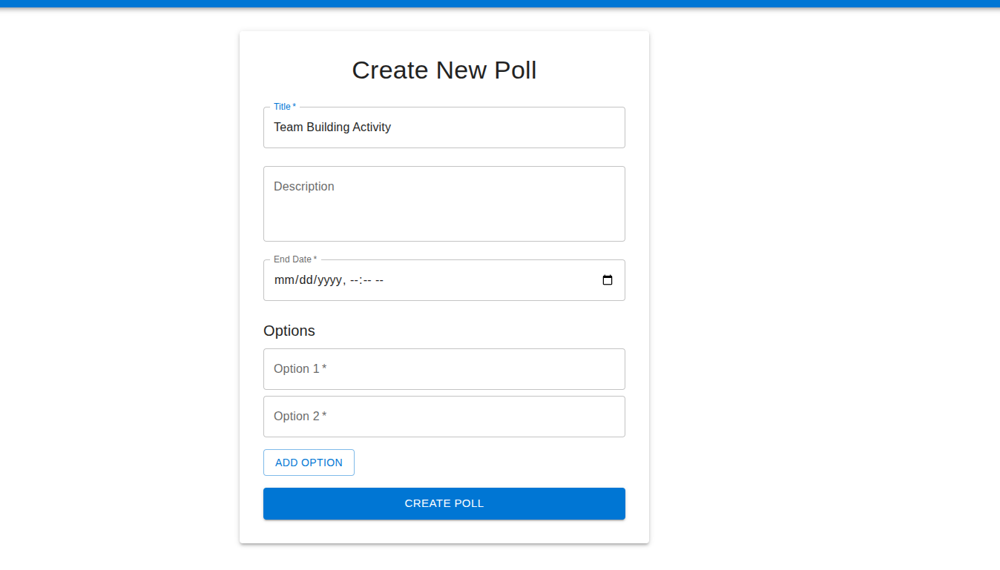
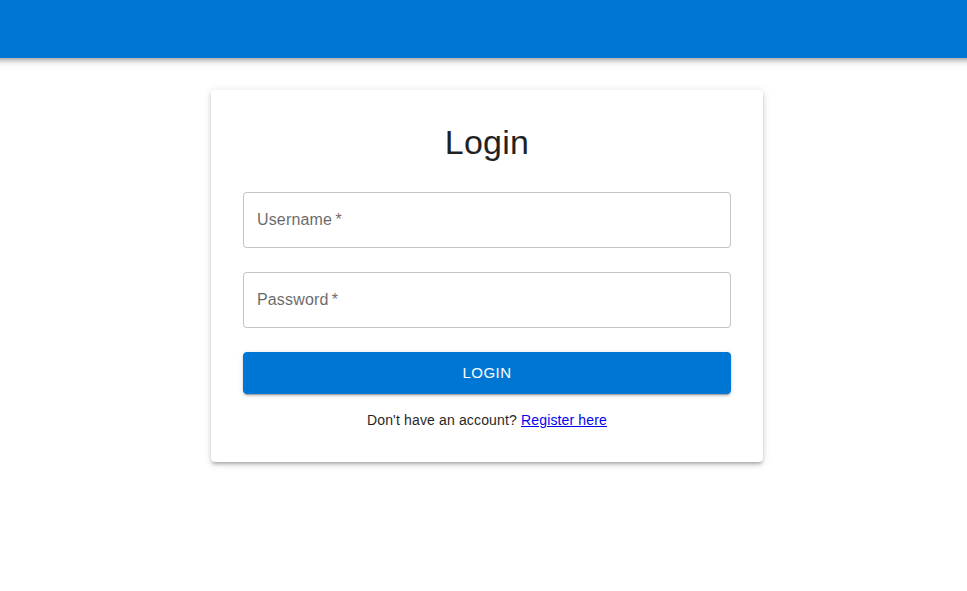
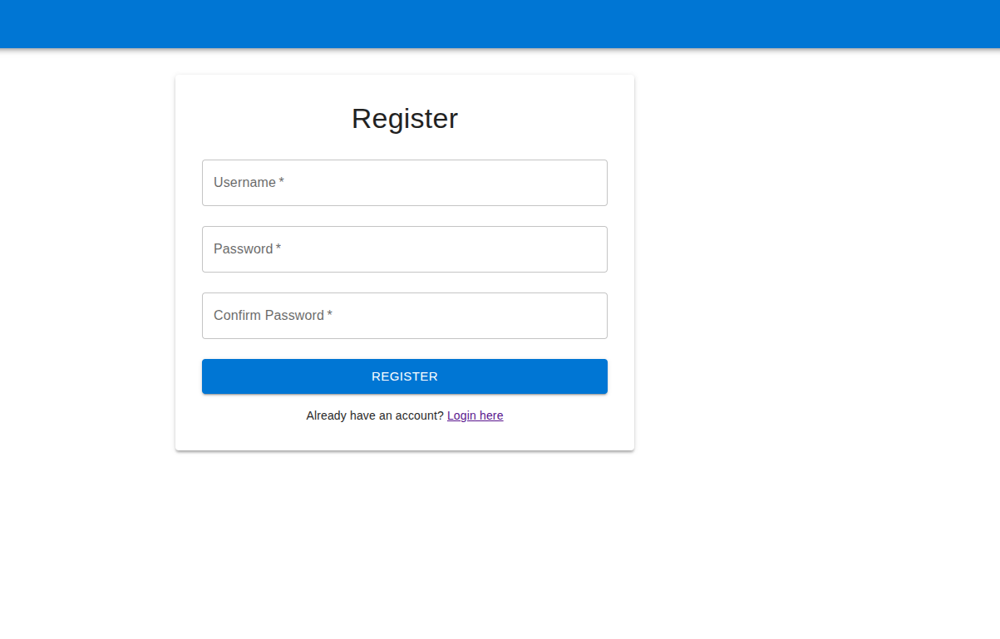

# Voting Application

A modern web-based voting application deployed on OpenShift.

## Features

- Create and manage polls
- Real-time vote counting
- User authentication
- Responsive design
- OpenShift deployment ready

## Project Structure

```
.
├── backend/           # Flask backend application
├── frontend/         # React frontend application
├── openshift/        # OpenShift configuration files
└── README.md         # This file
```

## Prerequisites

- Python 3.8+
- Node.js 14+
- OpenShift CLI
- Docker

## Setup Instructions

### Backend Setup

1. Navigate to the backend directory:
   ```bash
   cd backend
   ```

2. Create and activate a virtual environment:
   ```bash
   python -m venv venv
   source venv/bin/activate  # On Windows: venv\Scripts\activate
   ```

3. Install dependencies:
   ```bash
   pip install -r requirements.txt
   ```

4. Run the development server:
   ```bash
   python app.py
   ```

### Frontend Setup

1. Navigate to the frontend directory:
   ```bash
   cd frontend
   ```

2. Install dependencies:
   ```bash
   npm install
   ```

3. Start the development server:
   ```bash
   npm start
   ```

## OpenShift Deployment

1. Login to OpenShift:
   ```bash
   oc login
   ```

2. Create a new project:
   ```bash
   oc new-project voting-app
   ```

3. Deploy the application:
   ```bash
   oc apply -f openshift/
   ```

## Screenshots

### Create New Poll


### Login Page


### Register Page


## License

MIT 